# API de Gerenciamento de Cursos

Esta é uma API RESTful construída com Fastify e TypeScript para gerenciamento de cursos. O projeto utiliza Drizzle ORM para operações com banco de dados PostgreSQL e inclui documentação API com Swagger e Scalar API Reference.

## 🚀 Tecnologias

- Node.js
- TypeScript
- Fastify
- PostgreSQL
- Drizzle ORM
- Zod (para validação)
- Docker (para containerização do banco)
- Swagger & Scalar API Reference (para documentação)

## 📋 Funcionalidades

- Criar novos cursos
- Listar todos os cursos
- Buscar curso por ID
- Validação de dados com Zod
- Documentação automática da API
- Migrações de banco com Drizzle Kit

## 🗄️ Estrutura do Banco

### Tabela de Cursos

- `id` (UUID, Chave Primária)
- `title` (Texto, Único)
- `description` (Texto, Opcional)

### Tabela de Usuários

- `id` (UUID, Chave Primária)
- `name` (Texto)
- `email` (Texto, Único)

## 🏗️ Arquitetura

```mermaid
graph LR
    subgraph Fluxo da Aplicação
        A[GitHub] -->|criar bloco de código| B[Mermaid]
        B -->|informar tipo do diagrama| C[Bloco]
        C -->|montar diagrama| D[Conteúdo]
        D -->|terminar diagrama| C
        C -->|fechar bloco| B
        B -->|visualizar diagrama| A
    end

    style A fill:#2D333B,stroke:#30363D,stroke-width:2px
    style B fill:#2D333B,stroke:#30363D,stroke-width:2px
    style C fill:#2D333B,stroke:#30363D,stroke-width:2px
    style D fill:#2D333B,stroke:#30363D,stroke-width:2px
```



## 🚀 Como Iniciar

1. Clone o repositório
2. Instale as dependências:

```bash
npm install
```

3. Inicie o banco PostgreSQL:

```bash
docker-compose up -d
```

4. Configure as variáveis de ambiente:
   Crie um arquivo `.env` com:

```env
DATABASE_URL=
PORT=
NODE_ENV=
```

5. Execute as migrações do banco:

```bash
npm run db:migrate
```

6. Inicie o servidor de desenvolvimento:

```bash
npm run dev
```

## 📚 Scripts Disponíveis

- `npm run dev` - Inicia servidor de desenvolvimento com watch mode
- `npm run db:generate` - Gera migrações do banco
- `npm run db:migrate` - Executa migrações do banco
- `npm run db:studio` - Abre Drizzle Studio para gerenciamento do banco

## 📖 Documentação da API

Em modo de desenvolvimento, você pode acessar:

- Swagger UI: `http://localhost:3333/swagger`
- Scalar API Reference: `http://localhost:3333/docs`

## 🛣️ Rotas da API

### POST /courses

Criar um novo curso

- Corpo: `{ title: string, description?: string }`
- Resposta: `{ courseId: uuid }`

### GET /courses

Listar todos os cursos

- Resposta: `{ courses: Array<Course> }`

### GET /courses/:id

Buscar curso por ID

- Parâmetros: `id: uuid`
- Resposta: `{ course: Course }`
